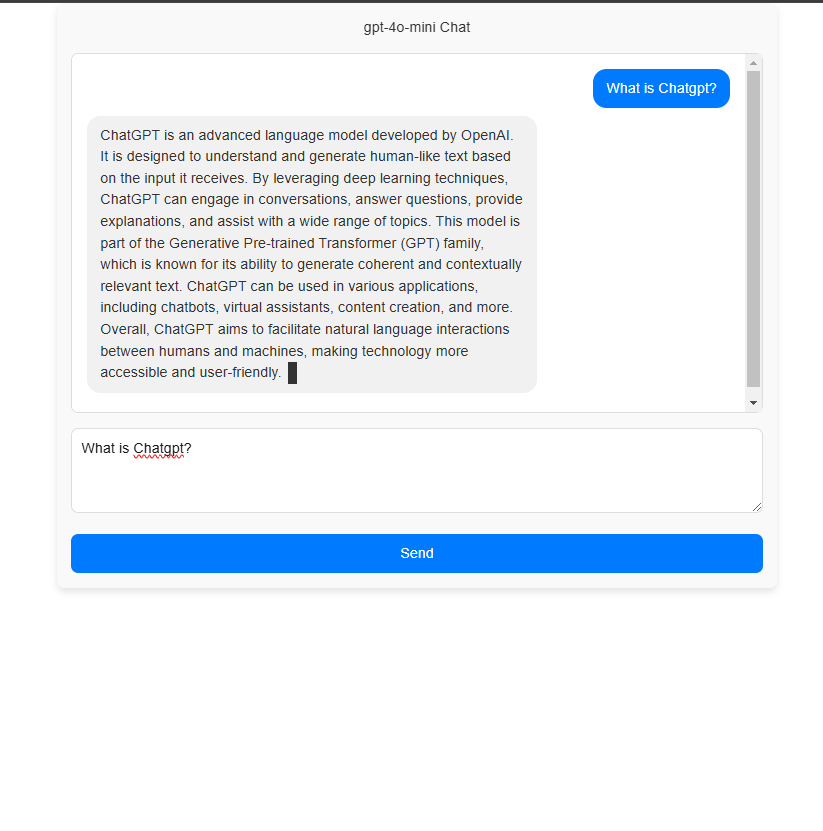

# Next.Js Chatbot
Welcome to the **Next.Js Chatbot** project! This Next.js application integrates OpenAI's ChatGPT API to provide a dynamic and interactive chatbot experience. The chatbot delivers well-structured HTML responses, enhanced by a smooth typing effect for greater user engagement.
---
## Table of Contents
1. [Features](#features)
2. [Demo](#demo)
3. [Technologies Used](#technologies-used)
4. [Prerequisites](#prerequisites)
5. [Installation](#installation)
6. [Configuration](#configuration)
7. [Running the Application](#running-the-application)
8. [Project Structure](#project-structure)
9. [Usage](#usage)
10. [Security Considerations](#security-considerations)
11. [Contributing](#contributing)
12. [License](#license)
13. [Contact](#contact)
---
## Features
- **Interactive Chat Interface**: Engage with the chatbot in a user-friendly chat window.
- **Typing Effect**: Responses appear with a natural typing animation, enhancing user experience.
- **HTML Responses**: Chatbot replies are formatted in clean, well-structured HTML for rich content display.
- **Sanitized Content**: All HTML is sanitized with DOMPurify to prevent XSS attacks.
- **Responsive Design**: Works seamlessly across various devices and screen sizes.
- **Error Handling**: Robust error handling for API failures and invalid inputs.
---
## Demo
*A screenshot of the Next.Js Chatbot interface showcasing user and chatbot messages.*


---
## Technologies Used
- **Next.js**: React framework for server-rendered applications.
- **React**: Library for building user interfaces.
- **OpenAI API**: GPT-4o-Mini model for generating responses.
- **DOMPurify**: Library for sanitizing HTML.
- **CSS-in-JS**: Scoped styling with styled-jsx.
- **JavaScript**: Frontend and backend logic.
---
## Prerequisites
Ensure you have the following before starting:
1. **Node.js**: Install Node.js (v14 or later) [here](https://nodejs.org).
2. **npm or Yarn**: Package manager for dependencies.
3. **OpenAI API Key**: Obtain an API key from [OpenAI](https://platform.openai.com/).
---
## Installation
1. Clone the Repository:
   ```bash
   git clone https://github.com/tahahussain53110/nextjs-openai.git
   cd nextjs-openai
   ```
2. Install Dependencies:
   - Using npm:
     ```bash
     npm install
     ```
   - Using Yarn:
     ```bash
     yarn install
     ```
---
## Configuration
1. Create a `.env.local` file in the root directory:
   ```plaintext
   OPENAI_API_KEY=your-openai-api-key-here
   ```
2. Ensure `.env.local` is included in `.gitignore` to keep your API key secure.
**Environment Variables Explanation:**
- `OPENAI_API_KEY`: Your secret key for accessing OpenAI's API.
---
## Running the Application
Start the development server:
- Using npm:
  ```bash
  npm run dev
  ```
- Using Yarn:
  ```bash
  yarn dev
  ```
Open your browser and navigate to [http://localhost:3000](http://localhost:3000).
---
## Project Structure
```
nextjs-openai/
├── pages/
│   ├── api/
│   │   └── generate.js       # Backend API route for chatbot responses
│   └── index.js              # Frontend chat interface
├── public/
│   └── screenshots/
│       └── chatbot-interface.png
├── styles/
│   └── globals.css           # Global CSS styles
├── .env.local                # Environment variables (not committed)
├── package.json              # Project dependencies and scripts
├── README.md                 # Project documentation
└── ...
```
---
## Usage
1. **Interact with the Chatbot**:
   - Type your message in the textarea at the bottom of the chat window.
   - Press **Enter** or click the **Send** button.
2. **Example Interaction**:
   - **User**: "Hello, how are you?"
   - **Chatbot**:
     ```html
     <p>Hello! :wave:</p>
     <p>I'm doing well, thank you! How can I assist you today?</p>
     ```
---
## Security Considerations
1. **Sanitization with DOMPurify**:
   - Ensures HTML responses are safe and free from malicious scripts (XSS attacks).
2. **Environment Variables**:
   - API keys are stored securely in `.env.local`.
3. **Content Security Policy (CSP)**:
   - Consider implementing a CSP for enhanced security.
---
## Contributing
We welcome contributions! Follow these steps:
1. **Fork the Repository**: Click the "Fork" button at the top-right corner of the GitHub page.
2. **Clone Your Fork**:
   ```bash
   git clone https://github.com/tahahussain53110/nextjs-openai.git
   cd nextjs-openai
   ```
3. **Create a New Branch**:
   ```bash
   git checkout -b feature/YourFeatureName
   ```
4. **Make Your Changes**: Implement your feature or bug fix.
5. **Commit Your Changes**:
   ```bash
   git commit -m "Add feature: YourFeatureName"
   ```
6. **Push to Your Fork**:
   ```bash
   git push origin feature/YourFeatureName
   ```
7. **Open a Pull Request**: Navigate to the original repository and click on "Compare & pull request."